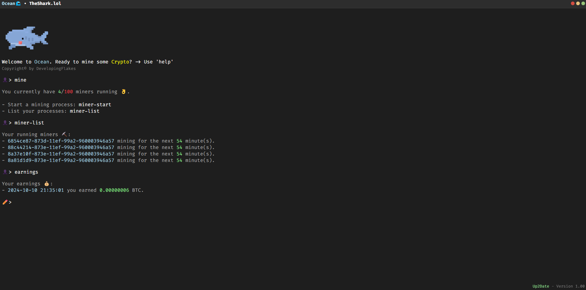

# 🌊 Ocean
Welcome to the official repository of Ocean, an application that simplifies crypto mining and allows anyone to start a miner in Finland with a few commands.
### [Download](https://github.com/TheShark-lol/ocean/archive/refs/heads/prod.zip) · [Documentation](https://ocean.theshark.lol)

## How does it work??? Isnt that scam?
We have been operating our own GPU racks in the Netherlands and Finland for several years. Like any business, there are fluctuations—some months one or two GPUs may generate a negative return, while other months show positive results. That's the nature of the operation.

We now offer the opportunity to purchase a license, allowing you to run multiple miners simultaneously. The revenue generated helps cover employee wages, server maintenance, and electricity costs. In return, you receive system-generated income in the form of BTC.

It's important to note that, while there is potential for profit, there is also the risk of loss. However, we are confident in the strength of our position and the stability of our operations.

## How to install?
1. Download the repository which contains a simple html and some dll files for querying and using some PC components (no, we do not do crypto mining on your device.) The entire software can be opened and controlled via the html file.
2. Now open the ocean.html file, you should see our console.

## How to purchase?
We are currently not allowing purchases as we are in closed beta. You can of course download the software without a license, but you do not have access to the miners. You can request a (free) beta license in the Discord at discord.gg/theshark.
